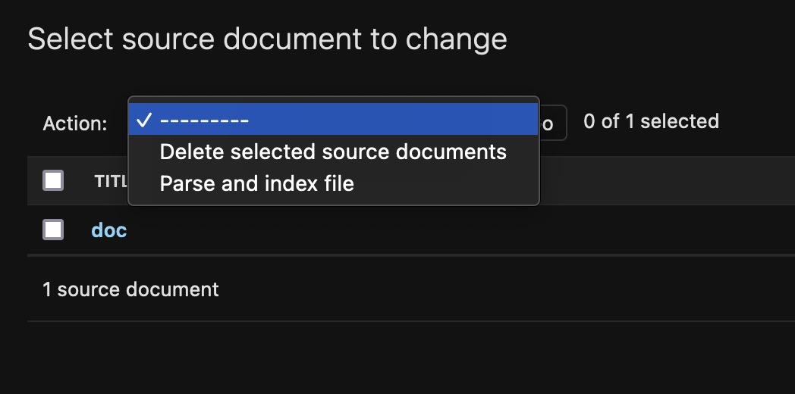
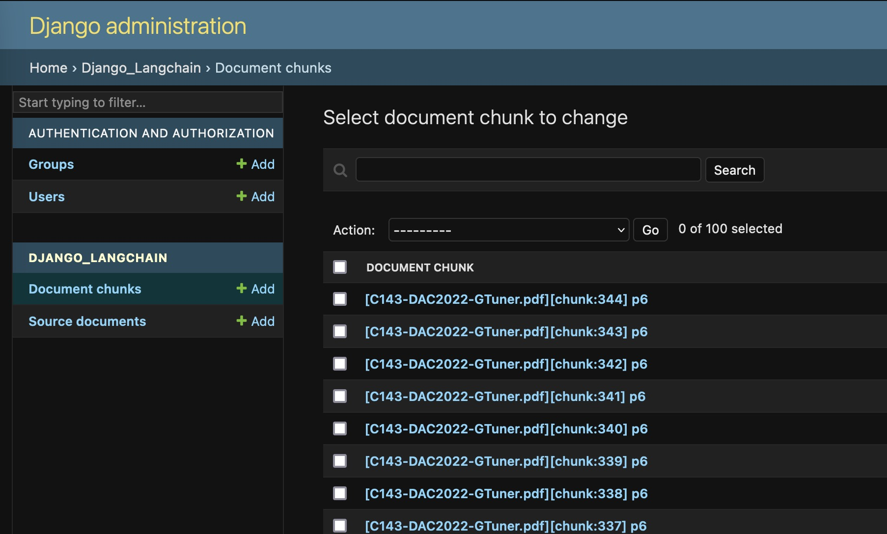

# Django Langchain

## What's this ?

This package aims to provide integration between LangChain and Django.

This is very early and the current stage is : `alpha`

## Compatibility

LangChain is moving at a fast pace and interfaces may change.
Version pinning is not enforced at the time to be able to use latest releases.

This package is built using 

- LangChain v0.0.229
- Django 4.2
- Python 3.9

## Database requirements

You have to use a pgvector-enabled Postgresql database


## Roadmap

Never ending todo : 

- [X] Base document models (chunks and sources)
- [X] A LangChain-compliant document store 
- [X] Embeddings are computed via `SourceDocument.parse_file`
- [X] Bare-bone admin management interface
- [ ] Serializers (output) to use with Django REST Framework
- [ ] Comprehensive set of utilities binding LLM & chains
- [ ] (TBC)Serializers (input) to use with Django REST Framework
- [ ] (TBC) Add support for celery or other async queuing system
- [ ] (TBC) Add support for data visualization in django admin


## Quickstart

### Using the admin site

1. Store a file in `SourceDocument` model
2. Perform the admin action `Parse and index file`



3. Check for `DocumentChunk` instances



4. Perform a similarity search using Django's admin built-in search (returns 5 most relevant results)


### Using the console

```python
from django_langchain.models import SourceDocument

source_doc = SourceDocument(title='< Title >', file='< /path/to/file/ >')
source_doc.save()

#: This could take some time and some non-trivial amount of RAM
source_doc.parse_file()
print(source_doc.documentchunk_set.count())
```

```python
from django_langchain.models import DocumentChunk, DocumentChunkStore

# Perform a similarity search
queryset = DocumentChunk.objects.search('< query >', max_results=5)

# Or using DocumentStore Langchain interface

store = DocumentChunkStore()
source, doc = store.search("< query >")

print(doc.metadata)
print(doc.page_content)
```
